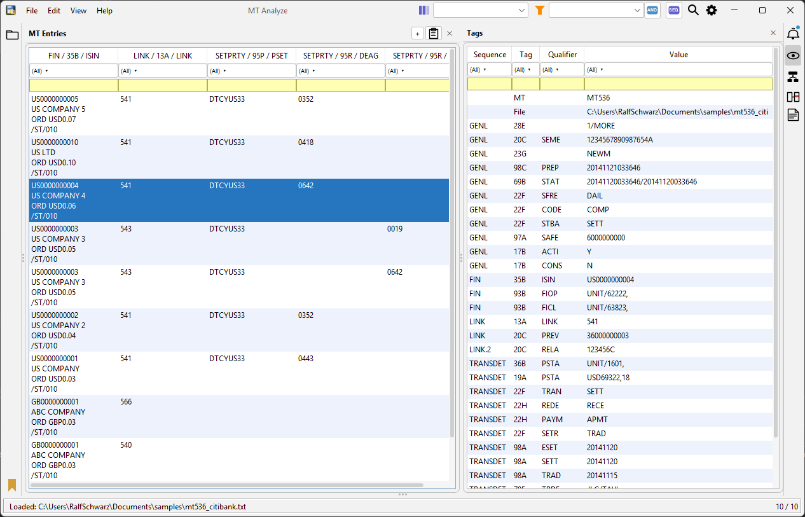
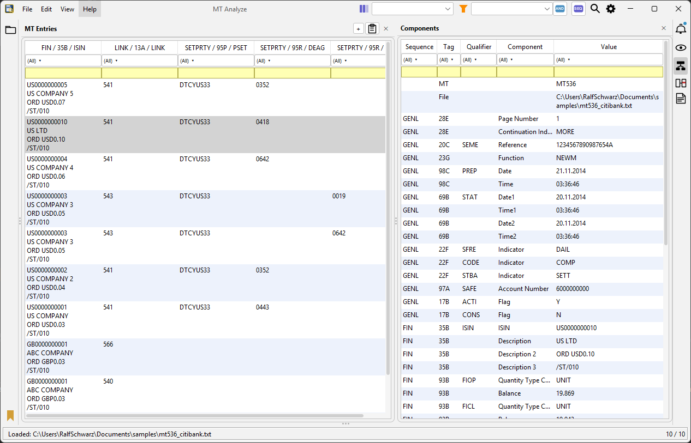
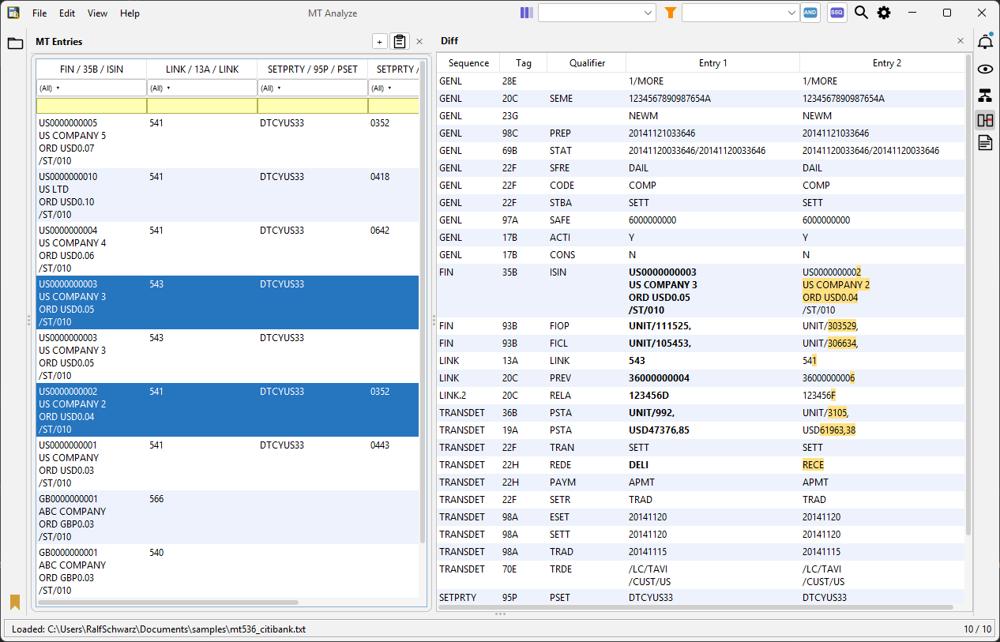
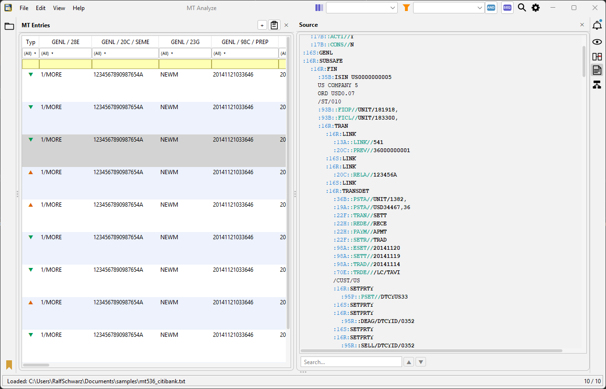

# MT Analyze
**SWIFT MT analysis for migration and change projects — and day-to-day business use.**

[](https://github.com/mtanalyze/mtanalyze/actions/workflows/release.yml)
[](https://sonarcloud.io/summary/overall?id=mtanalyze_mtanalyze)
[](https://sonarcloud.io/summary/overall?id=mtanalyze_mtanalyze)
[](https://sonarcloud.io/summary/overall?id=mtanalyze_mtanalyze)

MT Analyze is a lightweight open-source desktop tool for analysing SWIFT MT messages (ISO 15022) and posting data. It looks like a spreadsheet — sort, filter, copy & paste. Inside it natively understands SWIFT MT: tags, qualifiers, components and sequences are decoded and annotated with descriptions from the ISO 15022 Data Field Dictionary SR2025, built in. No access to myStandards required. No prior SWIFT MT knowledge needed.

Statement messages such as MT 536 or MT 940 — which carry many entries per message — and single-entry messages such as settlement instructions or confirmations are handled uniformly: any mix loads into one table, one row per entry, ready to sort, filter, and compare across the full dataset.

Built on [Prowide Core](https://github.com/prowide/prowide-core). Minimal dependencies. Self-contained JAR — no installation, no admin rights.

---

## Screenshots

**Entries table with Tag View**


**Entries table with Components View**



**Entries table with Diff View**



**Entries table with Source View**


---

## Getting Started

**Requirements:** Java 17 or higher.

MT Analyze is a single self-contained JAR — all libraries are bundled inside. No installation, no admin rights required. An optional `mtanalyze.properties` file placed next to the JAR controls advanced settings (see [Configuration](#configuration)).

1. Go to [Releases](https://github.com/mtanalyze/mtanalyze/releases)
2. Download the latest `MT-Analyze-<version>.jar`
3. Double-click the JAR, or run:

```bash
java -jar MT-Analyze-1.0.1.jar
```

---

## Quick Start

1. **Load messages** — drag one or more MT files onto the table, or use **File → Open**. Each FIN object appears as one row.
2. **Read tag descriptions** — click any row. The **Tag View** panel opens on the right and shows every tag with its sequence, qualifier, decoded value, and the ISO 15022 description from the built-in dictionary. Enable the **Components** checkbox to expand multi-part fields (amounts, dates, identifiers) into individually labelled sub-fields with tooltips.
3. **Label entries** — right-click a row and choose **Add Note** to attach a free-text label (e.g. the purpose of the instruction, the counterparty, or a status remark). Notes appear as a column in the table and are saved with the session.
4. **Compare messages** — select two or more rows with `Ctrl+Click`, then switch to **Diff View** (`Ctrl+5`) to see deviating fields highlighted side by side.
5. **Filter** — click the filter icon on any column header for a checkbox list, or type an expression directly (e.g. `=TRAD`, `^CEDE`, `!=FREE`).

---

## Features

- **Entries Table** — FIN objects from any mix of MT types and files loaded into a single sortable, filterable table. Each row is one FIN object; columns are the decoded tag/qualifier fields.
- **Tag View** (`Ctrl+4`) — click any row to open the Tag View panel on the right. It shows a full tag breakdown: sequence, tag number, qualifier, decoded value, and the **ISO 15022 description** for each tag and qualifier value — no SWIFT knowledge required to understand what a field means. Enable the **Components** checkbox to expand multi-part fields (e.g. `98A`, `92A`, `35B`) into individually labelled sub-fields with descriptions. Hover over any cell for additional tooltips.
- **Entry Notes** — right-click any row and choose **Add Note** to attach a free-text label to that entry. Notes appear as a column in the Entries table and are saved with the session as `:70E::NOTE//text`. Use **Edit Note** to jump directly to the note field in the Tag View, or **Available Notes** to apply an existing note from another entry — useful for stamping a status or counterparty remark across multiple rows.
- **Diff View** (`Ctrl+5`) — select two or more rows to compare FIN objects side by side; deviating cells are highlighted. Toggle "Differences only" to restrict to changed fields.
- **Source View** (`Ctrl+6`) — raw SWIFT MT message with colour-coded block delimiters, tags, qualifiers, and indented sequence blocks.
- **Filtering** — Filter Row (Excel-style checkbox list per column) and Quick Filter (expression language: `=EUR`, `!=`, `^DE`, `$00`, `10-20`, `+` for OR). Filters combine as AND or OR. Right-click any filter button to convert to Quick Filter or clear all column filters in one step.
- **File Explorer** — collapsible folder tree panel; drag a folder to add it as a root, multi-select files to open them at once (`Ctrl+E`).
- **Sessions** — save and restore a set of loaded messages as a `.mtd` file (plain SWIFT MT text). Entry notes are persisted as `:70E::NOTE//text` fields and restored on load.
- **Reference Search** — resolves linked settlement messages (MT 540–548) by SEME, RELA, PREV, and TRCI reference fields.
- **Bookmarks** — right-click any row to bookmark it with a note; bookmarks persist across sessions.
- **Log File Import** — load SWIFT messages embedded in application log files; multi-line messages are reassembled automatically.
- **Paste & Parse** — paste raw SWIFT text directly via **Edit → Paste MT Snippet**. Includes a Fix Encoding button that corrects Mainframe EBCDIC CP273 mis-conversions (`ä→{`, `ü→}`).
- **Export** — CSV (full or component-expanded), and raw MT file export with configurable BIC headers.
- **Validate SWIFT File** — **File → Validate SWIFT File…** loads any SWIFT FIN file and shows a detailed diagnostic report: Prowide parser log (WARNING/SEVERE messages), parser errors, block structure (blocks 1–5 with raw content), message info (type, sender, receiver), and JSON representations of the parsed message. Use this to inspect malformed or non-standard files without loading them into the table.
- **Attach Block 5** — **File → Attach Block 5…** reads a complete SWIFT FIN file, lets you set a MAC value (default `00000000`), and writes the modified file with a `{5:{MAC:…}}` trailer block appended. If Block 5 already exists the MAC tag is replaced; other trailer tags (e.g. `CHK`) are preserved. Useful for adding a dummy trailer to files that were stripped of Block 5 before transmission testing.
- **Parser Log Notifications** — WARNING and SEVERE messages emitted by Prowide Core during any import (file, directory, log file, paste) are captured and shown automatically in the **Notifications** panel. The panel opens and expands so parser warnings are always visible without opening the console.
- **User Dictionary** — custom qualifier-value descriptions that extend the built-in ISO 15022 Data Field Dictionary SR2025. Entries can be added via **Settings → User Dictionary** or by editing `~/.mtanalyze/user_qualifier_values.csv` directly in Excel (see [User Dictionary](#user-dictionary)).
- **Account Mapping** — lookup table mapping SAFE identifiers to account numbers and descriptions.

---

## Supported Message Types

MT Analyze uses the [Prowide Core](https://github.com/prowide/prowide-core) parser and supports the full range of SWIFT MT message types. The types most relevant to securities post-trade are:

| Type       | Description                                      |
|------------|--------------------------------------------------|
| MT 527     | Triparty Collateral Instruction                  |
| MT 535     | Statement of Holdings                            |
| MT 536     | Statement of Transactions                        |
| MT 537     | Statement of Pending Transactions                |
| MT 540–543 | Settlement Instructions                          |
| MT 544–547 | Settlement Confirmations                         |
| MT 548     | Settlement Status and Processing Advice          |
| MT 558     | Triparty Collateral Status and Processing Advice |
| MT 940     | Customer Statement Message                       |

Files containing multiple message types are supported. If the message type cannot be detected automatically, MT Analyze will prompt the user to select it.

---

## Configuration

Place an `mtanalyze.properties` file next to the JAR to override defaults. All settings are optional.

| Property | Default | Description |
|---|---|---|
| `max.entries` | `1000` | Maximum entries loaded per session |
| `log.swift.start` | `{1:` | String marking the start of an embedded SWIFT message in log files |
| `log.newline.token` | `\n` | Token representing a newline within a log-embedded message |
| `experimental.mode` | `false` | Enable work-in-progress features |

A documented template is available in [`doc/mtanalyze.properties`](doc/mtanalyze.properties).

---

## User Dictionary

MT Analyze ships with descriptions for SWIFT MT tags, qualifiers, and qualifier values drawn from the **ISO 15022 Data Field Dictionary SR2025** (e.g. settlement instruction types, transaction codes, place codes). You can extend or replace these with your own entries — useful for organisation-specific codes, custom CSDs, or proprietary qualifier values.

Qualifier values are **message-type-independent** by design: a qualifier such as `SETR` carries the same meaning whether it appears in an MT 540, MT 544, or MT 548, so one dictionary entry covers all message types. The same applies to status codes (`PEND`, `MACH`, …) and place codes (`SAFE` values).

All dictionary files live in the `~/.mtanalyze/` folder in your home directory (`%USERPROFILE%\.mtanalyze\` on Windows, `~/.mtanalyze/` on macOS/Linux). MT Analyze creates this folder automatically on first run.

### Adding custom qualifier-value descriptions

The simplest way is **Settings → User Dictionary** — entries added there are saved to `~/.mtanalyze/user_qualifier_values.csv` and take effect immediately.

You can also edit the file directly in **Excel**:

1. Open `~/.mtanalyze/user_qualifier_values.csv` in Excel (the file is written with a UTF-8 BOM so Excel opens it without an import wizard).
2. Edit the table — one row per entry:

| Qualifier | Value | Description |
|-----------|-------|-------------|
| SAFE | CEDELULL | Clearstream Luxembourg |
| SAFE | DEUTDEFFXXX | Deutsche Bank Frankfurt |
| PSTA | MACH | Matched |

3. Save as CSV (keep the semicolon delimiter and the header row).
4. Restart MT Analyze — the new entries appear as tooltips in the Tag View and Component View.

The **Qualifier** and **Value** columns are matched case-insensitively. Matching is first tried as an exact equals, then as a contains check, so a composite cell value such as `CEDELULL/` is still resolved by the `CEDELULL` entry.

User entries take precedence over the built-in ISO 15022 Data Field Dictionary SR2025 entries.

### Replacing entire built-in dictionaries

For larger customisations — for example a completely different set of CSD identifiers for a regional market — you can replace any built-in dictionary by placing a file with the same name in `~/.mtanalyze/`:

| File | Columns | Covers |
|------|---------|--------|
| `dict_qualifier_values.csv` | `Qualifier;Value;Description` | Qualifier value tooltips (SAFE codes, PSTA codes, …) |
| `dict_qualifiers.csv` | `Qualifier;Description` | Column header tooltips |
| `dict_tags.csv` | `Tag;Description` | SWIFT tag tooltips |
| `dict_components.csv` | `Component;Description` | Component label tooltips |

When a file is found in `~/.mtanalyze/`, it replaces the built-in dictionary for that type entirely. All files are semicolon-delimited UTF-8 with a header row (the first row is always skipped).

---

## Dependencies

Two dependencies. That is all.

- **[Prowide Core](https://github.com/prowide/prowide-core)** SRU2025-10.3.14 — SWIFT MT message parsing (Apache License 2.0)
- **[FlatLaf](https://github.com/JFormDesigner/FlatLaf)** 3.7.1 — modern flat look and feel with dark mode support (Apache License 2.0)

---

## Security

Every release ships:
- **Automated release build** — JAR is built from source via GitHub Actions on each release; no pre-built binaries committed to the repository
- **SonarCloud** scan results (badges above)
- **GitHub Dependabot** — automated dependency vulnerability alerts and pull requests

---

## Contributing

Bug reports, feature requests, and pull requests are welcome. Please open an [issue](https://github.com/mtanalyze/mtanalyze/issues) first to discuss larger changes.

---

## Trademarks

SWIFT is a registered trademark of S.W.I.F.T. SCRL. MT Analyze is an independent open source project and is not affiliated with, sponsored by, or endorsed by S.W.I.F.T. SCRL or any other organisation mentioned in this documentation.

---

## License

Copyright 2026 [Centerscout GmbH](https://www.centerscout.de)

Licensed under the [Apache License 2.0](LICENSE).
